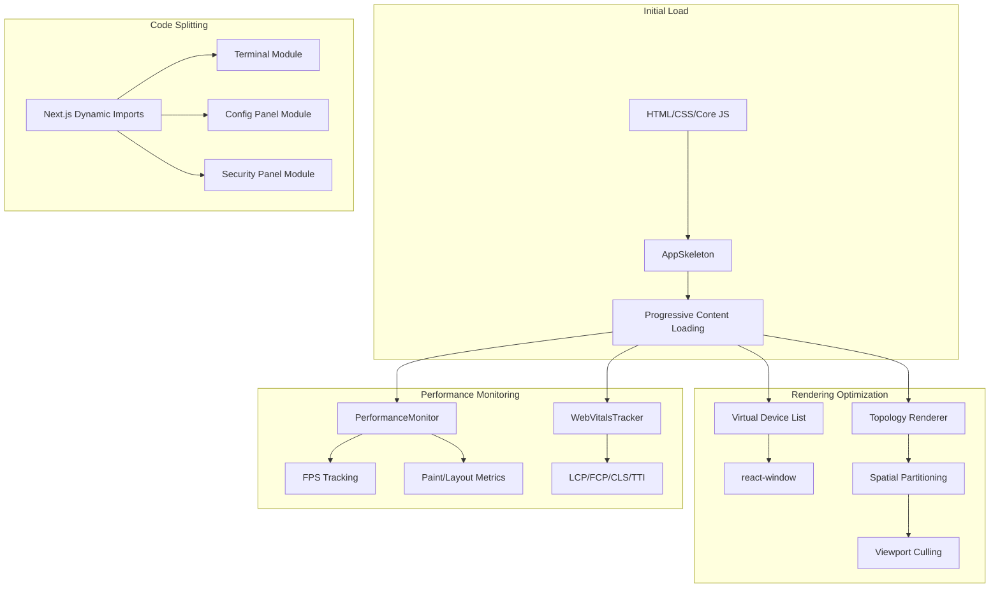

# Design Document: Phase 2 UI/UX Performance Improvements

## Overview

This design document outlines the technical architecture for Phase 2 UI/UX Performance Improvements, focusing on rendering performance and loading optimization. The implementation targets a 30% reduction in initial page load time, maintains 60 FPS during complex topology rendering, reduces memory usage by 25%, and improves LCP by 40%.

## Architecture

### High-Level Architecture Diagram



## Components and Interfaces

### 1. Virtual Device List Component

**Purpose**: Render large device lists efficiently using virtualization

**Key Interfaces**:
- `VirtualDeviceList`: Main virtualization wrapper
- `DeviceListItem`: Individual item renderer
- `VirtualDeviceListProps`: Configuration interface

**Implementation Details**:
- Uses `react-window` FixedSizeList for efficient rendering
- Maintains buffer of 5 items above/below viewport
- Supports dynamic height calculation
- Integrates with Zustand for state management

### 2. Topology Spatial Partitioning System

**Purpose**: Optimize topology rendering for large networks

**Key Components**:
- `SpatialPartitioner`: Divides viewport into grid cells
- `ViewportCuller`: Determines visible nodes and connections
- `TopologyRenderer`: Renders only visible items

**Algorithm**:
```
1. Divide topology into grid cells (e.g., 256x256px)
2. Assign each node to cell based on position
3. On viewport change:
   - Calculate visible cells
   - Fetch nodes from visible cells
   - Render only visible nodes + margin
4. Use spatial indexing for connection culling
```

### 3. Code Splitting Architecture

**Purpose**: Reduce initial bundle size through dynamic imports

**Module Structure**:
- `Terminal`: Lazy-loaded terminal module
- `ConfigPanel`: Lazy-loaded configuration module
- `SecurityPanel`: Lazy-loaded security module
- `AboutModal`: Lazy-loaded about modal
- `ContextMenu`: Lazy-loaded context menu
- `PortSelectorModal`: Lazy-loaded port selector

**Implementation Pattern**:
```typescript
const Terminal = dynamic(() => import('./Terminal'), {
  loading: () => <SkeletonTerminal />,
  ssr: false
});
```

### 4. Progressive Loading System

**Purpose**: Display skeleton screens during content loading

**Components**:
- `AppSkeleton`: Main layout skeleton
- `SkeletonTopology`: Topology placeholder
- `SkeletonDeviceList`: Device list placeholder
- `SkeletonPanel`: Generic panel placeholder

**Layout Consistency**:
- Skeleton dimensions match final content
- Prevents Cumulative Layout Shift (CLS)
- Smooth fade transition on content load

### 5. Performance Monitoring System

**Purpose**: Track rendering performance metrics

**Metrics Tracked**:
- Frame rate (FPS)
- Paint time
- Layout time
- Node render count
- Memory usage

**API**:
```typescript
interface PerformanceMetrics {
  fps: number;
  paintTime: number;
  layoutTime: number;
  nodesRendered: number;
  memoryUsage: number;
}

interface PerformanceMonitor {
  getMetrics(): PerformanceMetrics;
  onFrameDrop(callback: (fps: number) => void): void;
  reset(): void;
}
```

### 6. Web Vitals Tracking System

**Purpose**: Monitor Core Web Vitals metrics

**Metrics**:
- LCP (Largest Contentful Paint)
- FCP (First Contentful Paint)
- CLS (Cumulative Layout Shift)
- TTI (Time to Interactive)

**Implementation**:
- Uses `web-vitals` library
- Reports to analytics service
- Logs warnings for poor metrics

### 7. Image Optimization System

**Purpose**: Optimize image loading and serving

**Components**:
- `OptimizedDeviceIcon`: Next.js Image wrapper
- `ResponsiveImage`: Responsive image component
- `SVGInliner`: Inline SVG optimization

**Features**:
- Lazy loading for off-screen images
- Responsive sizing based on viewport
- WebP format with fallbacks
- Proper alt text and accessibility

### 8. Memory Optimization System

**Purpose**: Reduce memory usage for large topologies

**Techniques**:
- Object pooling for topology nodes
- Efficient data structures (typed arrays)
- Proper cleanup and garbage collection
- Event listener management

**Object Pool Pattern**:
```typescript
class NodePool {
  private available: Node[] = [];
  private inUse: Set<Node> = new Set();
  
  acquire(): Node {
    return this.available.pop() || new Node();
  }
  
  release(node: Node): void {
    node.reset();
    this.available.push(node);
    this.inUse.delete(node);
  }
}
```

### 9. Connection Line Rendering System

**Purpose**: Efficiently render topology connections

**Optimization Techniques**:
- Batch rendering operations
- Incremental updates (only redraw affected lines)
- Spatial indexing for visibility culling
- Zoom-aware rendering

**Rendering Pipeline**:
```
1. Collect visible connections
2. Batch into render groups
3. Use requestAnimationFrame for batching
4. Only redraw changed connections
5. Use canvas or optimized SVG
```

### 10. State Update Optimization

**Purpose**: Minimize re-renders during topology changes

**Patterns**:
- Zustand selectors for granular subscriptions
- Immutable update patterns
- Update batching with `unstable_batchedUpdates`
- Selective component re-rendering

**Zustand Selector Pattern**:
```typescript
const nodeCount = useTopologyStore((state) => state.nodes.length);
const selectedNode = useTopologyStore((state) => state.selectedNode);
```

## Data Models

### Virtual List State
```typescript
interface VirtualListState {
  itemCount: number;
  itemHeight: number;
  scrollOffset: number;
  visibleRange: { start: number; end: number };
  bufferSize: number;
}
```

### Spatial Partition
```typescript
interface SpatialCell {
  x: number;
  y: number;
  nodes: Node[];
  connections: Connection[];
}

interface SpatialPartition {
  cellSize: number;
  cells: Map<string, SpatialCell>;
  bounds: Bounds;
}
```

### Performance Metrics
```typescript
interface PerformanceSnapshot {
  timestamp: number;
  fps: number;
  paintTime: number;
  layoutTime: number;
  nodesRendered: number;
  memoryUsage: number;
}
```

### Web Vitals
```typescript
interface WebVitalsMetrics {
  lcp: number;
  fcp: number;
  cls: number;
  tti: number;
  timestamp: number;
}
```

## Correctness Properties

*A property is a characteristic or behavior that should hold true across all valid executions of a system—essentially, a formal statement about what the system should do. Properties serve as the bridge between human-readable specifications and machine-verifiable correctness guarantees.*

### Property 1: Virtual List Rendering Invariant

*For any* device list with more than 100 items, the DOM SHALL contain only visible items plus a buffer of 5 items above and below the viewport.

**Validates: Requirements 1.1, 1.4**

### Property 2: Virtual List Scroll Performance

*For any* scrolling interaction on a virtualized device list, the frame rate SHALL maintain at least 60 FPS.

**Validates: Requirements 1.2**

### Property 3: Virtual List State Preservation

*For any* device list with active selection or filtering, the virtualization state SHALL be maintained correctly after selection/filtering operations.

**Validates: Requirements 1.5**

### Property 4: Virtual List Recalculation

*For any* change to list height or item count, the VirtualDeviceList SHALL automatically recalculate visible items without manual intervention.

**Validates: Requirements 1.6**

### Property 5: Topology Spatial Partitioning

*For any* topology with more than 500 nodes, the NetworkTopology component SHALL use spatial partitioning to optimize rendering.

**Validates: Requirements 2.1**

### Property 6: Topology Pan/Zoom Performance

*For any* panning or zooming interaction on the topology, the frame rate SHALL maintain at least 60 FPS.

**Validates: Requirements 2.2**

### Property 7: Topology Viewport Culling

*For any* topology viewport, only nodes and connections within the viewport plus a margin SHALL be rendered.

**Validates: Requirements 2.3, 2.5**

### Property 8: Topology Viewport Recalculation

*For any* change to the topology viewport, the visible node set SHALL be recalculated and updated efficiently.

**Validates: Requirements 2.6**

### Property 9: Initial Bundle Exclusion

*For any* application load, the initial bundle SHALL NOT include code for non-critical features (Terminal, ConfigPanel, SecurityPanel).

**Validates: Requirements 3.1**

### Property 10: Dynamic Module Loading

*For any* user action that opens a feature module (Terminal, ConfigPanel, SecurityPanel), the module code SHALL be loaded dynamically.

**Validates: Requirements 3.2, 3.3, 3.4**

### Property 11: Feature Module Loading States

*For any* dynamically loaded feature module, the application SHALL display a loading indicator or skeleton screen during loading.

**Validates: Requirements 3.6**

### Property 12: Lazy Component Exclusion

*For any* application load, lazy-loaded components (AboutModal, ContextMenu, PortSelectorModal) SHALL NOT be loaded until explicitly requested.

**Validates: Requirements 4.1, 4.2, 4.3**

### Property 13: Lazy Loading State Handling

*For any* lazy-loaded component, the application SHALL handle loading states gracefully without errors or blank screens.

**Validates: Requirements 4.4**

### Property 14: Lazy Loading Performance

*For any* lazy-loaded component request, the loading time SHALL be less than 100ms.

**Validates: Requirements 4.5**

### Property 15: Progressive Loading Skeleton Display

*For any* initial page load, the AppSkeleton component SHALL display a skeleton representation of the main layout.

**Validates: Requirements 5.1**

### Property 16: Skeleton Layout Consistency

*For any* skeleton screen, the layout dimensions SHALL match the final rendered content to prevent layout shift.

**Validates: Requirements 5.5**

### Property 17: Skeleton Content Replacement

*For any* content loading completion, skeleton screens SHALL be replaced smoothly with actual content.

**Validates: Requirements 5.6**

### Property 18: Image Optimization

*For any* device icon display, the image SHALL be optimized using Next.js Image component with proper attributes.

**Validates: Requirements 6.1, 6.5**

### Property 19: Responsive Image Serving

*For any* image load, the application SHALL serve appropriately sized images based on device screen size.

**Validates: Requirements 6.2**

### Property 20: Image Format Support

*For any* image display, the application SHALL use modern formats (WebP) with fallbacks for older browsers.

**Validates: Requirements 6.3**

### Property 21: Image Lazy Loading

*For any* off-screen image, the application SHALL defer loading until the image enters the viewport.

**Validates: Requirements 6.4**

### Property 22: SVG Inlining

*For any* SVG icon usage, the application SHALL inline SVG to avoid additional HTTP requests.

**Validates: Requirements 6.6**

### Property 23: FPS Tracking

*For any* application runtime, the PerformanceMonitor SHALL continuously track frame rate (FPS).

**Validates: Requirements 7.1**

### Property 24: Paint/Layout Measurement

*For any* rendering operation, the PerformanceMonitor SHALL measure paint time and layout time.

**Validates: Requirements 7.2**

### Property 25: Topology Render Metrics

*For any* topology rendering, the PerformanceMonitor SHALL track the number of nodes rendered and rendering time.

**Validates: Requirements 7.3**

### Property 26: Performance Metrics Availability

*For any* performance monitoring session, collected metrics SHALL be available for analysis and debugging.

**Validates: Requirements 7.4**

### Property 27: Frame Drop Warnings

*For any* frame rate drop below 60 FPS, the PerformanceMonitor SHALL log warnings.

**Validates: Requirements 7.5**

### Property 28: Debug Panel Exposure

*For any* application runtime, the PerformanceMonitor SHALL expose metrics via a debug panel or console API.

**Validates: Requirements 7.6**

### Property 29: LCP Measurement

*For any* page load, the WebVitalsTracker SHALL measure Largest Contentful Paint (LCP).

**Validates: Requirements 8.1**

### Property 30: FCP Measurement

*For any* page load, the WebVitalsTracker SHALL measure First Contentful Paint (FCP).

**Validates: Requirements 8.2**

### Property 31: CLS Measurement

*For any* page load, the WebVitalsTracker SHALL measure Cumulative Layout Shift (CLS).

**Validates: Requirements 8.3**

### Property 32: TTI Measurement

*For any* page interaction, the WebVitalsTracker SHALL measure Time to Interactive (TTI).

**Validates: Requirements 8.4**

### Property 33: Web Vitals Reporting

*For any* Web Vitals measurement, the metrics SHALL be reported to analytics or logging service.

**Validates: Requirements 8.5**

### Property 34: Web Vitals Threshold Warnings

*For any* Web Vitals metric exceeding acceptable thresholds, the application SHALL log warnings.

**Validates: Requirements 8.6**

### Property 35: Critical Asset Loading Order

*For any* application load, critical assets (HTML, CSS, core JavaScript) SHALL be loaded before non-critical assets.

**Validates: Requirements 9.1**

### Property 36: Deferred Non-Critical Asset Loading

*For any* non-critical asset, the application SHALL defer loading until after initial render.

**Validates: Requirements 9.2**

### Property 37: HTTP Caching Headers

*For any* static asset, the application SHALL use HTTP caching headers to enable browser caching.

**Validates: Requirements 9.3**

### Property 38: Service Worker Asset Caching

*For any* active service worker, assets SHALL be cached for offline access.

**Validates: Requirements 9.4**

### Property 39: Responsive Asset Serving

*For any* image asset, the application SHALL use responsive image techniques to serve appropriate sizes.

**Validates: Requirements 9.5**

### Property 40: Cache Busting

*For any* asset update, the cache busting mechanism SHALL ensure users receive the latest versions.

**Validates: Requirements 9.6**

### Property 41: Object Pooling for Nodes

*For any* topology with many nodes, the application SHALL use object pooling to reuse node objects.

**Validates: Requirements 10.1**

### Property 42: Node Cleanup

*For any* node removal from topology, the application SHALL properly clean up references to enable garbage collection.

**Validates: Requirements 10.2**

### Property 43: Event Listener Cleanup

*For any* node destruction, the application SHALL remove attached event listeners.

**Validates: Requirements 10.3**

### Property 44: Object Creation Efficiency

*For any* topology pan or zoom operation, the application SHALL not create new objects unnecessarily.

**Validates: Requirements 10.4**

### Property 45: Efficient Data Structures

*For any* large data structure usage, the application SHALL use efficient data structures (e.g., typed arrays for coordinates).

**Validates: Requirements 10.5**

### Property 46: Memory Usage Limit

*For any* typical topology, the application SHALL maintain memory usage below 150MB.

**Validates: Requirements 10.6**

### Property 47: Connection Render Batching

*For any* connection rendering operation, the application SHALL batch render operations to minimize repaints.

**Validates: Requirements 11.2**

### Property 48: Incremental Connection Updates

*For any* connection line update, the application SHALL only redraw affected lines, not the entire canvas.

**Validates: Requirements 11.3**

### Property 49: Zoom-Aware Connection Rendering

*For any* topology zoom operation, the connection line rendering SHALL adapt efficiently.

**Validates: Requirements 11.4**

### Property 50: Connection Spatial Indexing

*For any* connection visibility determination, the rendering system SHALL use spatial indexing.

**Validates: Requirements 11.5**

### Property 51: Incremental Connection Updates on Change

*For any* connection addition or removal, the rendering system SHALL update incrementally without full re-renders.

**Validates: Requirements 11.6**

### Property 52: Selective Component Re-rendering on Node Add

*For any* node addition to topology, the state update SHALL only trigger re-renders of affected components.

**Validates: Requirements 12.1**

### Property 53: Selective Component Re-rendering on Node Remove

*For any* node removal from topology, the state update SHALL not trigger re-renders of unrelated components.

**Validates: Requirements 12.2**

### Property 54: Immutable Update Patterns

*For any* topology state update, the application SHALL use immutable update patterns to enable efficient diffing.

**Validates: Requirements 12.3**

### Property 55: Update Batching

*For any* rapid topology changes, the application SHALL batch updates to minimize re-renders.

**Validates: Requirements 12.4**

### Property 56: Zustand Selector Usage

*For any* component subscription to topology state, the application SHALL use Zustand selectors to ensure components only re-render when their data changes.

**Validates: Requirements 12.5**

### Property 57: Non-Blocking State Updates

*For any* large topology data update, the state update mechanism SHALL handle it efficiently without blocking the main thread.

**Validates: Requirements 12.6**

## Error Handling

### Virtual List Errors
- Handle empty lists gracefully
- Manage scroll position out of bounds
- Handle dynamic height calculation failures

### Topology Rendering Errors
- Handle invalid node positions
- Manage connection rendering failures
- Handle viewport calculation errors

### Code Splitting Errors
- Retry failed module loads
- Display error boundary on module load failure
- Fallback to inline content if dynamic import fails

### Performance Monitoring Errors
- Handle missing performance API
- Gracefully degrade if metrics unavailable
- Log errors without blocking application

### Web Vitals Errors
- Handle missing Web Vitals API
- Gracefully degrade on older browsers
- Continue operation if tracking fails

## Testing Strategy

### Unit Testing

**Virtual List Tests**:
- Test rendering with various item counts
- Test scroll position calculations
- Test buffer management
- Test dynamic height updates

**Topology Tests**:
- Test spatial partitioning accuracy
- Test viewport culling correctness
- Test connection visibility determination
- Test zoom/pan calculations

**Code Splitting Tests**:
- Test module loading on demand
- Test loading state display
- Test error handling
- Test module caching

**Progressive Loading Tests**:
- Test skeleton screen display
- Test layout consistency
- Test smooth transitions
- Test content replacement

**Performance Monitoring Tests**:
- Test FPS calculation
- Test metric collection
- Test warning logging
- Test debug API

**Memory Optimization Tests**:
- Test object pooling
- Test cleanup operations
- Test garbage collection
- Test memory limits

### Property-Based Testing

**Property Test Configuration**:
- Minimum 100 iterations per test
- Each test references design property
- Tag format: `Feature: ui-ux-performance-improvements-phase2, Property {number}: {property_text}`

**Virtual List Properties**:
- Property 1: Rendering invariant (100+ items)
- Property 2: Scroll performance (60 FPS)
- Property 3: State preservation (selection/filtering)
- Property 4: Recalculation (height/count changes)

**Topology Properties**:
- Property 5: Spatial partitioning (500+ nodes)
- Property 6: Pan/zoom performance (60 FPS)
- Property 7: Viewport culling
- Property 8: Viewport recalculation

**Code Splitting Properties**:
- Property 9: Initial bundle exclusion
- Property 10: Dynamic module loading
- Property 11: Loading state display

**Lazy Loading Properties**:
- Property 12: Component exclusion
- Property 13: State handling
- Property 14: Loading performance (<100ms)

**Progressive Loading Properties**:
- Property 15: Skeleton display
- Property 16: Layout consistency
- Property 17: Smooth replacement

**Image Optimization Properties**:
- Property 18: Next.js Image usage
- Property 19: Responsive sizing
- Property 20: Format support
- Property 21: Lazy loading
- Property 22: SVG inlining

**Performance Monitoring Properties**:
- Property 23: FPS tracking
- Property 24: Paint/layout measurement
- Property 25: Topology metrics
- Property 26: Metrics availability
- Property 27: Frame drop warnings
- Property 28: Debug API

**Web Vitals Properties**:
- Property 29: LCP measurement
- Property 30: FCP measurement
- Property 31: CLS measurement
- Property 32: TTI measurement
- Property 33: Metrics reporting
- Property 34: Threshold warnings

**Asset Optimization Properties**:
- Property 35: Critical asset loading order
- Property 36: Deferred non-critical loading
- Property 37: HTTP caching
- Property 38: Service worker caching
- Property 39: Responsive serving
- Property 40: Cache busting

**Memory Optimization Properties**:
- Property 41: Object pooling
- Property 42: Node cleanup
- Property 43: Event listener cleanup
- Property 44: Object creation efficiency
- Property 45: Efficient data structures
- Property 46: Memory usage limit

**Connection Rendering Properties**:
- Property 47: Render batching
- Property 48: Incremental updates
- Property 49: Zoom adaptation
- Property 50: Spatial indexing
- Property 51: Incremental updates on change

**State Update Properties**:
- Property 52: Selective re-rendering on add
- Property 53: Selective re-rendering on remove
- Property 54: Immutable patterns
- Property 55: Update batching
- Property 56: Zustand selectors
- Property 57: Non-blocking updates
